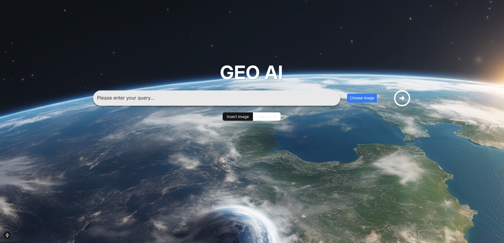
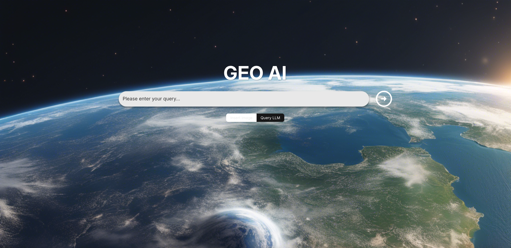
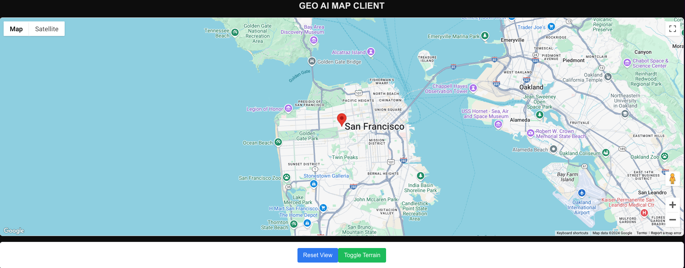

# Geo AI App 🌍

  
  

A modern web application that combines geographical data with cutting-edge artificial intelligence to provide users with an intuitive interface for analyzing spatial patterns and trends. Built with Next.js 13, TypeScript, and the latest geospatial analysis tools.

## 🚀 Features

- **Next.js 13 with App Router**: Leverages the latest version of Next.js for improved performance and developer experience.
- **Geospatial AI Analysis**: Integrates AI models trained on satellite and GIS data to enable advanced spatial analytics.
- **Intuitive Mapping Interface**: Allows users to explore and interact with geographical data through an easy-to-use mapping interface.
- **Natural Language Queries**: Supports natural language-based queries, enabling non-experts to perform complex geospatial analyses.
- **Drag-and-Drop Visualization**: Provides a user-friendly drag-and-drop interface for creating custom data visualizations.
- **Cloud-powered Scalability**: Designed to leverage cloud platforms like AWS for scalable and reliable performance.

## 🔧 Prerequisites

Before you begin, ensure you have installed:

- Node.js 18.0 or later
- npm or yarn or pnpm
- Python 3.9 or later

## 💻 Installation

1. Clone the repository:

   ```bash
   git clone https://github.com/willystout/geo_ai_app.git
   cd geo_ai_app
   ```

2. Install dependencies:

   ```bash
   npm install # or yarn install or pnpm install
   ```

3. Set up environment variables:

   ```bash
   cp .env.example .env.local
   # Add your environment variables: 
   OpenAI API Key: NEXT_PUBLIC_OPENAI_API_KEY
   Google Maps API Key: NEXT_PUBLIC_GOOGLE_MAPS_API_KEY
   supaBase URL: NEXT_PUBLIC_SUPABASE_URL
   supaBase Anon Key: NEXT_PUBLIC_SUPABASE_ANON_KEY

   ```

## 🎮 Development

1. Start the development server:

   ```bash
   npm run dev # or yarn dev or pnpm dev
   ```

2. Open [http://localhost:3000](http://localhost:3000) in your browser.

## 🏗️ Project Structure

```bash
├── app/        # Next.js 13 App Router pages and layouts
├── components/ # Reusable UI components
├── public/     # Static assets
└── styles/     # Global styles and CSS modules
```

## 🧪 Testing

```bash
# Run tests
npm run test

# Run tests in watch mode
npm run test:watch
```

## 👥 Contributing

We follow a feature branch workflow:

1. Branch off of `dev`: `git checkout dev && git pull origin dev && git checkout -b feature/your-feature-name`
2. Make your changes and commit: `git add . && git commit -m "feat: add new feature"`
3. Push and create a PR to `dev`: `git push origin feature/your-feature-name`

See [CONTRIBUTING.md](CONTRIBUTING.md) for detailed guidelines.

## 📚 Tech Stack

- [React](https://reactjs.org/) & [Next.js](https://nextjs.org/) - Modern frontend frameworks for building user interfaces
- [HTML](https://developer.mozilla.org/en-US/docs/Web/HTML) / [CSS](https://developer.mozilla.org/en-US/docs/Web/CSS) / [JavaScript](https://developer.mozilla.org/en-US/docs/Web/JavaScript) - Core web technologies for frontend development
- [Clay](https://huggingface.co/made-with-clay) / [Prithvi](https://huggingface.co/ibm-nasa-geospatial/Prithvi-100M) / [Google Earth Engine](https://earthengine.google.com/) - Foundation models and tools for geospatial analysis
- [OpenAI](https://openai.com/) - Large Language Model (LLM) for natural language processing
- [Python](https://www.python.org/) - Versatile programming language for backend development
- [NumPy](https://numpy.org/) / [Pandas](https://pandas.pydata.org/) - Python libraries for data manipulation and analysis
- [Slack](https://slack.com/) / [Lucidchart](https://www.lucidchart.com/) - Collaboration and communication tools
- [GitHub](https://github.com/) - Version control and code repository
- [Google Drive](https://www.google.com/drive/) / [Figma](https://www.figma.com/) - File storage and design collaboration tools

## 🚀 Deployment

This project is optimized for deployment on [Vercel](https://vercel.com):

1. Push your changes to GitHub.
2. Import your project to Vercel.
3. Configure environment variables.
4. Deploy!

For other deployment options, see the [Next.js deployment documentation](https://nextjs.org/docs/deployment).

## 📘 Learn More

- [Next.js Documentation](https://nextjs.org/docs)
- [Learn Next.js](https://nextjs.org/learn)
- [Next.js GitHub Repository](https://github.com/vercel/next.js)
- [Geospatial AI and Machine Learning Resources](https://huggingface.co/ibm-nasa-geospatial)

## 📫 Support

For support, email [your-email] or open an issue on GitHub.

## 📜 License

This project is licensed under the MIT License - see the [LICENSE](LICENSE) file for details.
